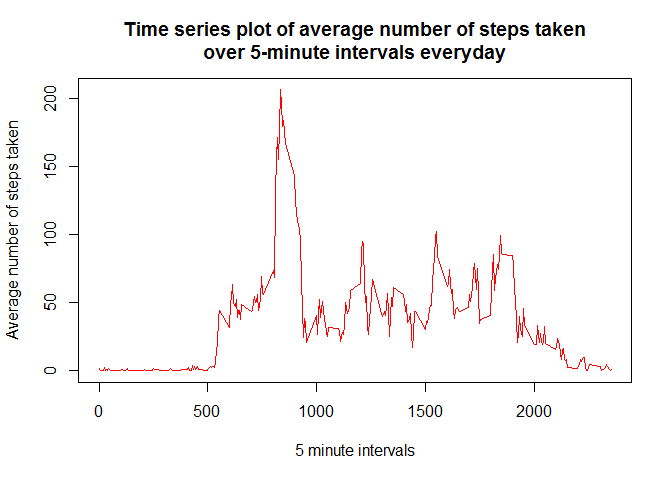

# Reproducible Research: Peer Assessment 1
Author: Stephen Lye  
Date: 10 September 2015  

## Loading and preprocessing the data

Show any code that is needed to:-
  
1. Load the data i.e. (read.csv())
2. Process/transform the data (if necessary) into a format suitable for your analysis

<font color = 'Red'>Note: </font>
The file name for the data in the assignment **(https://d396qusza40orc.cloudfront.net/repdata%2Fdata%2Factivity.zip)** is <font color = 'Purple'>repdata-data-activity.zip</font> but the one in the Github repo **(https://github.com/rdpeng/RepData_PeerAssessment1/blob/master/activity.zip)** is <font color = 'Purple'>activity.zip</font>. The code below uses the one in the repo.

```r
## Unzip source data file
if(!file.exists('activity.csv')) {
   ZipFile <- 'activity.zip'
   unzip(zipfile = ZipFile)
}

## Read the CSV file into a Data Frame
df_Activity <- read.csv('activity.csv', header = TRUE, sep = ',')
```

## What is mean total number of steps taken per day?

For this part of the assignment, you can ignore the missing values in the dataset.

1. Calculate the total number of steps taken per day

```r
## Sum the steps by date
df_Activity_Sum_Steps_By_Date <- aggregate(formula = steps ~ date,
                                 data = df_Activity, FUN = sum,
                                 na.rm = TRUE)

## Assign meaningful column names
names(df_Activity_Sum_Steps_By_Date) <- c('Date', 'Total_Steps_Per_Day')

## Show a subset of the Total number of steps taken per day
cat('Subset of the Total number of steps taken per day')
```

```
## Subset of the Total number of steps taken per day
```

```r
head(df_Activity_Sum_Steps_By_Date, 20L)
```

```
##          Date Total_Steps_Per_Day
## 1  2012-10-02                 126
## 2  2012-10-03               11352
## 3  2012-10-04               12116
## 4  2012-10-05               13294
## 5  2012-10-06               15420
## 6  2012-10-07               11015
## 7  2012-10-09               12811
## 8  2012-10-10                9900
## 9  2012-10-11               10304
## 10 2012-10-12               17382
## 11 2012-10-13               12426
## 12 2012-10-14               15098
## 13 2012-10-15               10139
## 14 2012-10-16               15084
## 15 2012-10-17               13452
## 16 2012-10-18               10056
## 17 2012-10-19               11829
## 18 2012-10-20               10395
## 19 2012-10-21                8821
## 20 2012-10-22               13460
```

2. If you do not understand the difference between a histogram and a barplot, research the difference between them. Make a histogram of the total number of steps taken each day

```r
## Histogram
hist(x = df_Activity_Sum_Steps_By_Date$Total_Steps_Per_Day,
     main = 'Histogram of the total number of steps taken each day',
     xlab = 'Total Steps',
     breaks = 50,
     col = 'Pink')
```

 


```r
## Barplot

## Load ggplot2 library - Make sure the library is installed first
library(ggplot2)

qplot(x = Total_Steps_Per_Day,
      data = df_Activity_Sum_Steps_By_Date,
      binwidth = 1,
      main = 'Bar Plot of the total number of steps taken each day',
      xlab = 'Total Steps',
      ylab = 'Frequency') +
      geom_histogram(colour = 'Black')
```

 

3. Calculate and report the mean and median of the total number of steps taken per day

<font color = 'Red'>Note: </font>
For the calculation of Mean and Median below, the days with all NAs are ignored. Each day has **288** 5-minute intervals. In total, there are **8 days** of NA data. This is derived by showing the frequency of all intervals as shown in the table (df_Complete_Summary) below ie. Interval 0 (NA) has **8** days of data (Column 1) and Interval 288 has **53** days of data (Column 2).

```r
## Show number of days of incomplete data (NA) and complete data
df_Complete <- df_Activity[complete.cases(df_Activity), ]
df_Complete_Summary <- summary(df_Complete$date)
table(df_Complete_Summary)
```

```
## df_Complete_Summary
##   0 288 
##   8  53
```

```r
## Calculate Mean Steps Per Day
Mean_Steps_Per_Day <- mean(df_Activity_Sum_Steps_By_Date$Total_Steps_Per_Day)

## Calculate Median Steps Per Day
Median_Steps_Per_Day <- median(df_Activity_Sum_Steps_By_Date$Total_Steps_Per_Day)

## Show the results
cat('For total number of steps taken each day:-',
    '\nMean =', Mean_Steps_Per_Day,
    '\nMedian =', Median_Steps_Per_Day)
```

```
## For total number of steps taken each day:- 
## Mean = 10766.19 
## Median = 10765
```

## What is the average daily activity pattern?

1. Make a time series plot (i.e. type = 'l') of the 5-minute interval (x-axis) and the average number of steps taken, averaged across all days (y-axis)

```r
## Calculate Mean Steps By Interval
df_Activity_Mean_Steps_By_Interval <- aggregate(formula = steps ~ interval,
                                      data = df_Activity, FUN = mean,
                                      na.rm = TRUE) 

## Time series plot
plot(steps ~ interval,
     data = df_Activity_Mean_Steps_By_Interval,
     type = 'l',
     main = 'Time series plot of average number of steps taken\nover 5-minute intervals everyday',
     xlab = '5 minute intervals',
     ylab = 'Average number of steps taken',
     col = 'Red')
```

 

2. Which 5-minute interval, on average across all the days in the dataset, contains the maximum number of steps?

```r
## Calculate Max Steps Per Interval
df_Max_Steps_Per_Interval <- df_Activity_Mean_Steps_By_Interval[which.max(df_Activity_Mean_Steps_By_Interval$steps), ]

## Convert time interval to character and add a Zero in front of the time interval to make it at least 4 characters
Interval <- paste('0', as.character(df_Max_Steps_Per_Interval[, 1]), sep = '')

## Extract only the last 4 characters of the time interval (hhmm)
if (nchar(Interval) > 4) {Interval <- substring(Interval, 2, 100L)}

## Separate hh and mm from the time interval and format it to hh:mm
Interval <- paste(substring(Interval, 1, 2), ':', substring(Interval, 3, 4), sep = '')

## Set time interval to 'AM' or 'PM'
if (substring(Interval, 1, 2) < '12') {
  Interval <- paste(Interval, 'AM')
} else {
  Interval <- paste(Interval, 'PM')
}

## Show the results
Max_Steps_Per_Interval <- df_Max_Steps_Per_Interval[, 2]

cat('Interval which has max number of steps on average across all the days:-',
'\nInterval =', Interval,
'\nMax Steps =', Max_Steps_Per_Interval)
```

```
## Interval which has max number of steps on average across all the days:- 
## Interval = 08:35 AM 
## Max Steps = 206.1698
```

## Imputing missing values

Note that there are a number of days/intervals where there are missing values (coded as NA). The presence of missing days may introduce bias into some calculations or summaries of the data.

1. Calculate and report the total number of missing values in the dataset (i.e. the total number of rows with NAs)

```r
## Calculate the number rows with NAs
Total_NA_Rows <- nrow(df_Activity[is.na(df_Activity), ])

## Show the results
cat('Total number of rows with NAs =', Total_NA_Rows)
```

```
## Total number of rows with NAs = 2304
```

2. Devise a strategy for filling in all of the missing values in the dataset. The strategy does not need to be sophisticated. For example, you could use the mean/median for that day, or the mean for that 5-minute interval, etc.

**Strategy employed to fill in NA values:-**

> Use the Average number of steps for **all** intervals within a day.

**Formula**

> Average number of steps for all intervals within a day
>
> = Average number of steps taken per day / Intervals per day
>
> = 10766.19 / 288
>
> = 37.3826

```r
## Calculate the intervals per day
Intervals_Per_Day <- nrow(df_Activity_Mean_Steps_By_Interval)

## Calculate Mean steps for all intervals within a day
Mean_Steps_All_Intervals <- Mean_Steps_Per_Day / Intervals_Per_Day
cat('Mean steps for all intervals within a day =', Mean_Steps_All_Intervals)
```

```
## Mean steps for all intervals within a day = 37.3826
```

3. Create a new dataset that is equal to the original dataset but with the missing data filled in.

```r
## Copy original data frame
df_Activity_NA_Filled <- df_Activity

## Fill in the missing NA values using Mean steps for all intervals within a day that was calculated earlier
df_Activity_NA_Filled[, 1] <- ifelse(is.na(df_Activity$steps), Mean_Steps_All_Intervals, df_Activity$steps)

## Show a subset of the original data with NAs filled
cat('Subset of the original data with NAs filled')
```

```
## Subset of the original data with NAs filled
```

```r
head(df_Activity_NA_Filled, 20L)
```

```
##      steps       date interval
## 1  37.3826 2012-10-01        0
## 2  37.3826 2012-10-01        5
## 3  37.3826 2012-10-01       10
## 4  37.3826 2012-10-01       15
## 5  37.3826 2012-10-01       20
## 6  37.3826 2012-10-01       25
## 7  37.3826 2012-10-01       30
## 8  37.3826 2012-10-01       35
## 9  37.3826 2012-10-01       40
## 10 37.3826 2012-10-01       45
## 11 37.3826 2012-10-01       50
## 12 37.3826 2012-10-01       55
## 13 37.3826 2012-10-01      100
## 14 37.3826 2012-10-01      105
## 15 37.3826 2012-10-01      110
## 16 37.3826 2012-10-01      115
## 17 37.3826 2012-10-01      120
## 18 37.3826 2012-10-01      125
## 19 37.3826 2012-10-01      130
## 20 37.3826 2012-10-01      135
```

4. Make a histogram of the total number of steps taken each day and Calculate and report the mean and median total number of steps taken per day. Do these values differ from the estimates from the first part of the assignment? What is the impact of imputing missing data on the estimates of the total daily number of steps?

```r
## Sum the steps by date
df_Activity_Sum_Steps_By_Date_2 <- aggregate(formula = steps ~ date,
                                   data = df_Activity_NA_Filled, FUN = sum)

## Assign meaningful column names
names(df_Activity_Sum_Steps_By_Date_2) <- c('Date', 'Total_Steps_Per_Day')

## Show a subset of the Total number of steps taken per day (after NA filled)
cat('Subset of the Total number of steps taken per day (after NA filled)')
```

```
## Subset of the Total number of steps taken per day (after NA filled)
```

```r
head(df_Activity_Sum_Steps_By_Date_2, 20L)
```

```
##          Date Total_Steps_Per_Day
## 1  2012-10-01            10766.19
## 2  2012-10-02              126.00
## 3  2012-10-03            11352.00
## 4  2012-10-04            12116.00
## 5  2012-10-05            13294.00
## 6  2012-10-06            15420.00
## 7  2012-10-07            11015.00
## 8  2012-10-08            10766.19
## 9  2012-10-09            12811.00
## 10 2012-10-10             9900.00
## 11 2012-10-11            10304.00
## 12 2012-10-12            17382.00
## 13 2012-10-13            12426.00
## 14 2012-10-14            15098.00
## 15 2012-10-15            10139.00
## 16 2012-10-16            15084.00
## 17 2012-10-17            13452.00
## 18 2012-10-18            10056.00
## 19 2012-10-19            11829.00
## 20 2012-10-20            10395.00
```

```r
## Histogram
hist(x = df_Activity_Sum_Steps_By_Date_2$Total_Steps_Per_Day,
     main = 'Histogram of the total number of steps taken each day',
     xlab = 'Total Steps',
     breaks = 50,
     col = 'Cyan')
```

 

```r
## Calculate the new Mean Steps Per Day
New_Mean_Steps_Per_Day <- mean(df_Activity_Sum_Steps_By_Date_2$Total_Steps_Per_Day)

## Calculate the new Median Steps Per Day
New_Median_Steps_Per_Day <- median(df_Activity_Sum_Steps_By_Date_2$Total_Steps_Per_Day)

## Show the results
cat('For total number of steps taken each day (after NA filled):-',
    '\nNew Mean =', New_Mean_Steps_Per_Day,
    '\nNew Median =', New_Median_Steps_Per_Day)
```

```
## For total number of steps taken each day (after NA filled):- 
## New Mean = 10766.19 
## New Median = 10766.19
```

<p>
<font color = 'Purple'>
Q: Do these values differ from the estimates from the first part of the assignment?
</font>
  
<font color = 'Red'>
A: Yes. The Median of the total number of steps per day has increased from **10,765** to **10,766.19**.
</font>
  
<font color = 'Purple'>
Q: What is the impact of imputing missing data on the estimates of the total daily number of steps?
</font>
  
<font color = 'Red'>
A: It causes the frequency of steps at the Median **(10,766.19)** to increase.
</font>
</p>
  
## Are there differences in activity patterns between weekdays and weekends?

For this part the weekdays() function may be of some help here. Use the dataset with the filled-in missing values for this part.

1. Create a new factor variable in the dataset with two levels - 'weekday' and 'weekend' indicating whether a given date is a weekday or weekend day.

```r
## Create a new column in the data frame (daynum) with the number of day in the week.
## (0 = Sun, 1 = Mon, ... 6 = Sat)
df_Activity_NA_Filled$daynum <- as.POSIXlt(df_Activity_NA_Filled$date)$wday

## Create a new factor column in the data frame (daytype) indicating whether the date is a 'weekday' or 'weekend'
df_Activity_NA_Filled$daytype <- as.factor(ifelse(df_Activity_NA_Filled$daynum == 0 |
df_Activity_NA_Filled$daynum == 6, c('weekend'), c('weekday')))

## Show the results

## -- Show a subset of Weekdays --
cat('Subset of Weekday data')
```

```
## Subset of Weekday data
```

```r
head(df_Activity_NA_Filled[df_Activity_NA_Filled$daytype == 'weekday', ], 10L)
```

```
##      steps       date interval daynum daytype
## 1  37.3826 2012-10-01        0      1 weekday
## 2  37.3826 2012-10-01        5      1 weekday
## 3  37.3826 2012-10-01       10      1 weekday
## 4  37.3826 2012-10-01       15      1 weekday
## 5  37.3826 2012-10-01       20      1 weekday
## 6  37.3826 2012-10-01       25      1 weekday
## 7  37.3826 2012-10-01       30      1 weekday
## 8  37.3826 2012-10-01       35      1 weekday
## 9  37.3826 2012-10-01       40      1 weekday
## 10 37.3826 2012-10-01       45      1 weekday
```

```r
## -- Show a subset of Weekends --
cat('Subset of Weekend data')
```

```
## Subset of Weekend data
```

```r
head(df_Activity_NA_Filled[df_Activity_NA_Filled$daytype == 'weekend', ], 10L)
```

```
##      steps       date interval daynum daytype
## 1441     0 2012-10-06        0      6 weekend
## 1442     0 2012-10-06        5      6 weekend
## 1443     0 2012-10-06       10      6 weekend
## 1444     0 2012-10-06       15      6 weekend
## 1445     0 2012-10-06       20      6 weekend
## 1446     0 2012-10-06       25      6 weekend
## 1447     0 2012-10-06       30      6 weekend
## 1448     0 2012-10-06       35      6 weekend
## 1449     0 2012-10-06       40      6 weekend
## 1450     0 2012-10-06       45      6 weekend
```

2. Make a panel plot containing a time series plot (i.e. type = 'l') of the 5-minute interval (x-axis) and the average number of steps taken, averaged across all weekday days or weekend days (y-axis). See the README file in the GitHub repository to see an example of what this plot should look like using simulated data.

```r
## Calculate Mean Steps By Interval
df_Activity_Mean_Steps_By_Interval_2 <- aggregate(steps ~ interval + daytype,
                                        data = df_Activity_NA_Filled, FUN = mean)

## Load Lattice library - Make sure the library is installed first
library(lattice)

## Time series plot
xyplot(steps ~ interval | daytype,   
  data = df_Activity_Mean_Steps_By_Interval_2,
  type = 'l',
  layout = c(1, 2),
  main = 'Time series plot of average number of steps taken\nover 5-minute intervals on weekends and weekdays',
  xlab = '5 minute intervals',
  ylab = 'Average number of steps taken',
  col = 'Blue')
```

 

<p>
<font color = 'Purple'>
Q: Are there differences in activity patterns between weekdays and weekends?
</font>
  
<font color = 'Red'>
A: Yes.
</font>
  
For <font color = 'Green'><b>weekends</b></font> - the activity starts later at around interval <font color = 'Red'>**700**</font> and <font color = 'Red'>**peaks twice**</font> around intervals <font color = 'Red'>**800 and 900**</font>.<br>
Then it flutuates between intervals <font color = 'Red'>**1000 and 2000**</font> but at higher level than weekdays.<br>
At an interval later than <font color = 'Red'>**2000**</font> the activity decreases.
  
For <font color = 'Blue'><b>weekdays</b></font> - the activity starts earlier at interval <font color = 'Red'>**500**</font> and <font color = 'Red'>**peaks once**</font> around intervals <font color = 'Red'>**800 and 900**</font>.<br>
Then it fluctuates between intervals <font color = 'Red'>**1000 and 2000**</font> but at a lower level than weekends.<br>
At interval <font color = 'Red'>**2000**</font> onwards the activity decreases.
<br><br>
</p>
  
**~ END ~**
